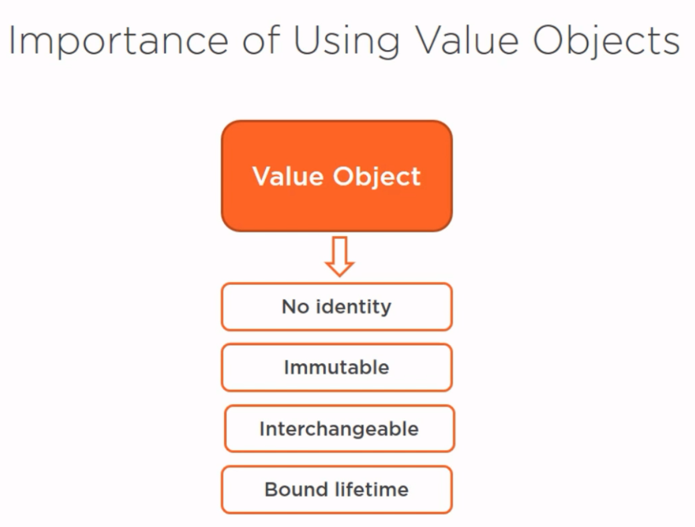
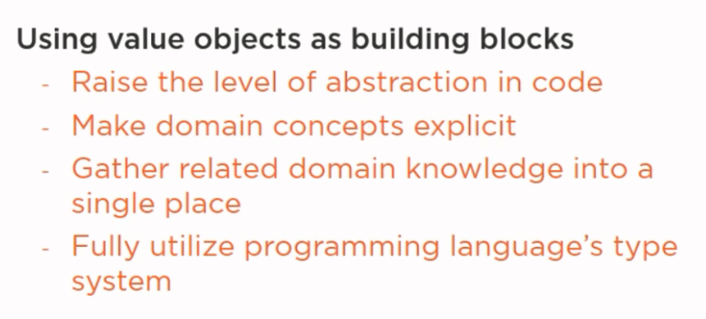
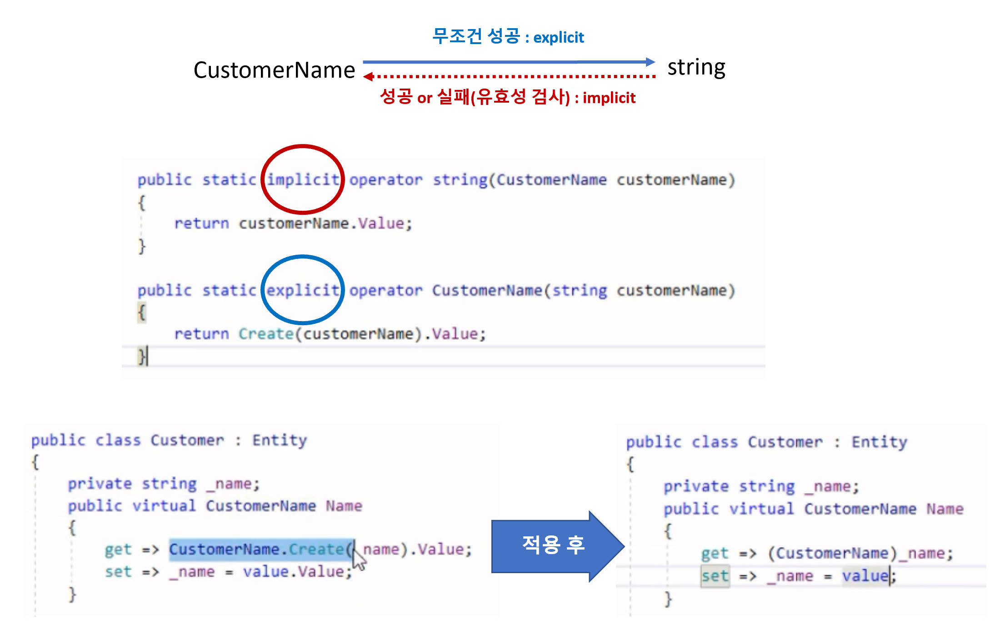
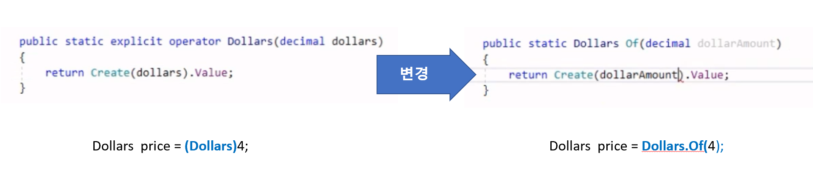

# 4장 Using Value Objects as Domain Model Building Blocks

## Encapsulation
- Encapsulation is an act of protecting the data integrity.
  - 캡슐화는 **데이터 무결성을 보호하는 행위입니다.** 
  - 지역화(Localization)
    - 도메인 객체와 관련된 모든 정보(데이터 + 행위 **+ 유효성 검사**)를 갖고 있다.
    - 중복 코드를 제거할 수 있다.
  - 유효성 규칙은 도메인 규칙이기 때문에 도메인 모델이 갖고 있어야 한다(Data Contracts에 정의하지 않는다).
    ```cs
    public class CustomerName : ValueObject<CustomerName>
    {
        private CustomerName( ... ) 
        {
            // ...
        }

        public static Result<CustomerName> Create( ... )
        {
            // 유효성 규칙 검증
            // 성공 or 실패
        }
    }
    ```
- 추상화 -(결과물)-> 캡슐화
  - Bundling data and operations together  
    - 관련 정보를 함께 **그룹화하므로** 이제 **더 적은 수의 개념을 처리해야하기** 때문에 도메인 모델을 단순화하는데 도움이된다.
  - Information hding
    - 단일 값으로 처리한다(Single value is good too).

- 버그 줄이고(↓), 도메인 표현은 높인다(↑).

## Value Object 정의


## Value Object 기대 효과
  
  
  

- **Raise the level of abstraction in code**
  - string -> CustomerName, Email
  - decimal -> Dollars
  - DateTime? -> ExpirationDate
- **Make domain concepts explicit**
  - null -> Infinite
- **Gather related domain knowledge into a single place**
  - Validation 규칙
  - if ... -> IsExpired
- **Fully utilize programming language's type system**
  - customer.Name = email; // 컴파일 에러

## Value Object 구현
- ValueObject<T>
  - Equal
  - Hashcode
- 정적 Factory Method 
  - Create
- explicit & implicit operator  
  
- explicit operator -> 정적 Factory Method(Of)  
  
- ORM mapping  
  

## Value Object 적용
- string -> CustomerName
  - Validation 중복 코드 제거
- string -> Email
- decimal -> Dollars
  - +, - 추가 연산 제공
- DateTime? -> ExpirationDate
  - Infinite : `null` 제거
