# 5장. Pushing Logic Down from Services to Domain Classes

## Domain Model(Value Object & Entity) 리팩토링 목표
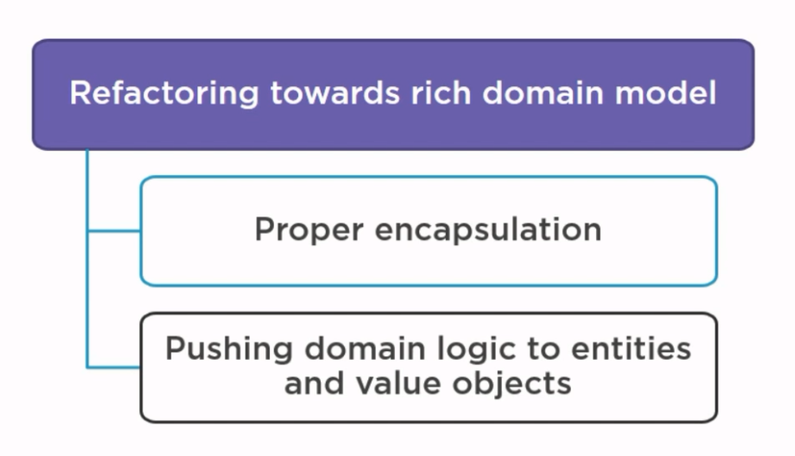

- 리팩토링 목표
  - `Mutable` Anemic Domain Model을 `Immutable` Domain Model 지향으로 개선한다.
  - 절대적으로 필요한 작업(데이터와 행위)만 명시적으로 남긴다.
    - 외부에서 데이터 변경을 최소화 시킨다.
- 리팩토링 기대 효과
  - ↑ : 도메인 표현을 높인다(간결한 코드).
    - 도메인 모델에서는 기술적인 용어를 최소화한다.  
      예. Id(X) vs. 도메인 객체(O)  
  - ↓ : 잠재적인 실수를 줄인다.
    - 내부 데이터를 외부에서 변경할 수 없도록 한다(불변).  
      예. 메서드를 통해 명시적으로 내부 데이터를 변경한다).
    - 메서드 제한적으로 제공한다.

## Customer Entity 리팩토링
### 생성자 리팩토링
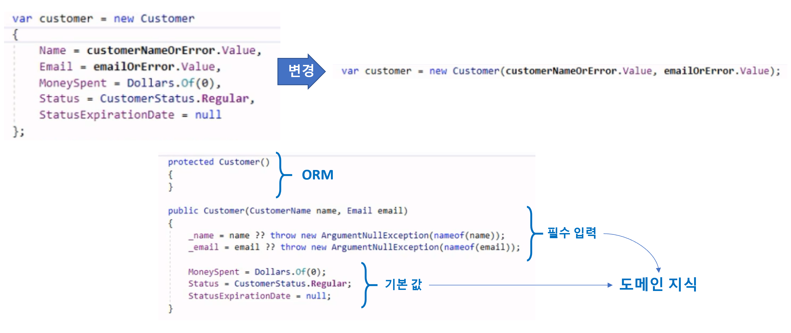

- 목표 : 데이터 ..   
- 구현 방법
  - 필수 데이터 : 생성자 매개변수
  - 기본 값 : 생성자 멤버 젼수 초기화
  
### 컬랙션 리팩토링
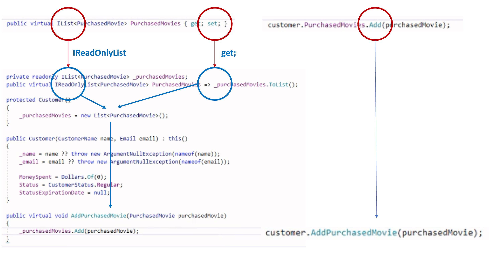

- 목표 : 
- 구현 방법  
  - 불변 컬랙션 : IReadOnlyList(vs. IEnumerable)
  - 불변 컬랙션 필드 : get
  - 가변 행위 : 명시적 메서드 정의

### 로직 트랜잭션 리팩토링
  

- 목표 : 
- 구현 방법
  - 메서드 통합 : 매개변수 추가
  - 불변 필드 : get

### 데이터 불일치 리팩토링
  
- 목표 : 식별값(Id)을 
- 구현 방법

### 값 객체 트랜잭션 리팩토링
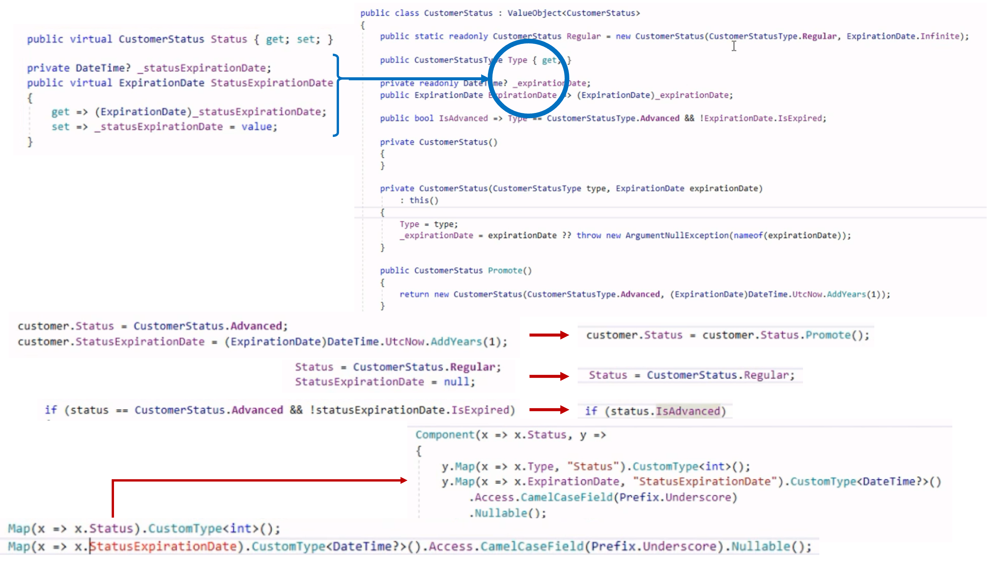  

- 목표 : 
- 구현 방법
  - 데이터 N개 -> 데이터 1개
  - 불변 필드 : get

## PurchasedMovie Entity 리팩토링
### 유비쿼터스(Ubiquitous)) 리팩토링
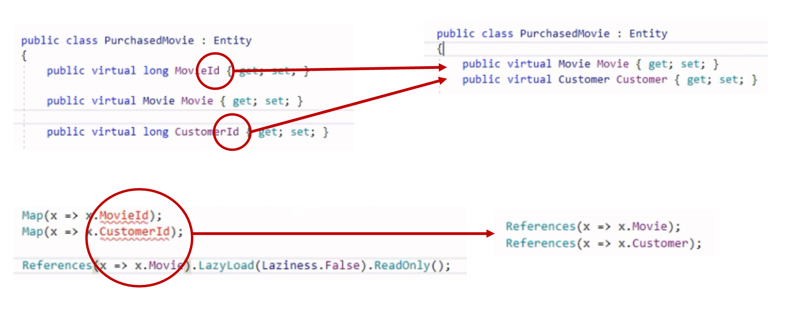  

- 목표 : 기술적 언어(Id) 보다는 도메인 표현을 사용한다. 
- 구현 방법
  - Id을 사용하지 않는다.

### 값 객체 리팩토링 제외  
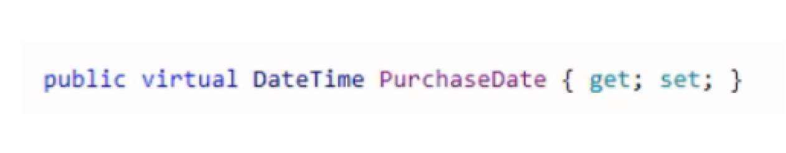  

- 리팩토링 제외 이유 : `PurchaseDate` 도메인을 표현하기 위해 `DateTime` 타입은 논리적인 버그 발생 가능성이 없다. 

### ORM Only(AggregateRoot)) 생성자 리팩토링
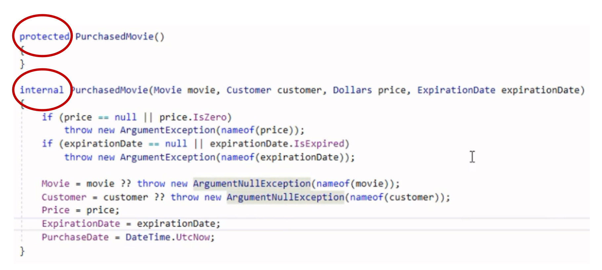  

- 목표 : 생성자자 호출을 제한한다.

## Movie Etity 리팩토링
### 상속
  

- 목표 : 반복적으로 발생하는 `switch` 구문을 클래스로 캡슐화한다.
- 구현 방법
  - ORM에서 상속을 구분하기 위한 식별자를 추가한다 : `DiscriminateSubClassesOnColumn`
  - `protected`을 접근하기 위한 ORM을 명시적으로 지정한다 : `reveal`

## Dollars Value Object 리팩토링
### 도메인 표현
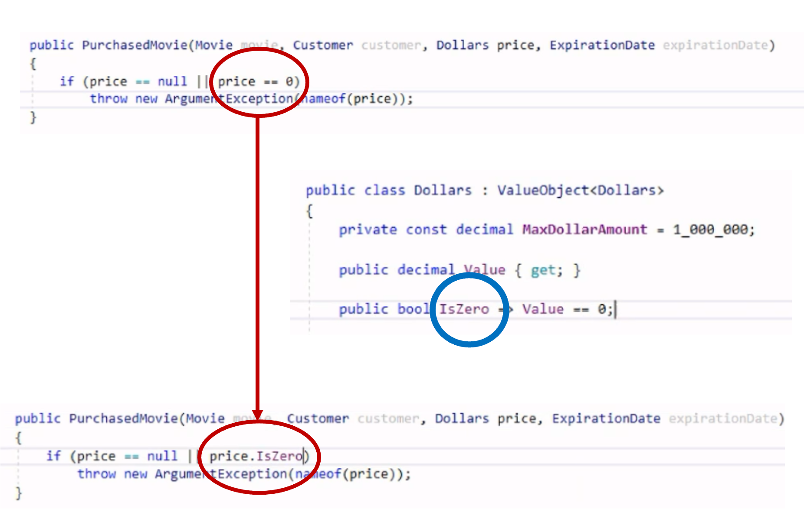  

- 목표 : 논리적 표현으로 비교한다.
- 구현 방법
  - IsZero

## Service 리팩토링 목표

## CustomerSerivce 리팩토링
### 로직 이동 
  

- Customer 데이터만으로 `Promote`을 구현하고 있다.
- 구현 방법
  - 로직은 더 가까운 도메인 모델로 이동 시킨다. 

### 로직 통합 이동 
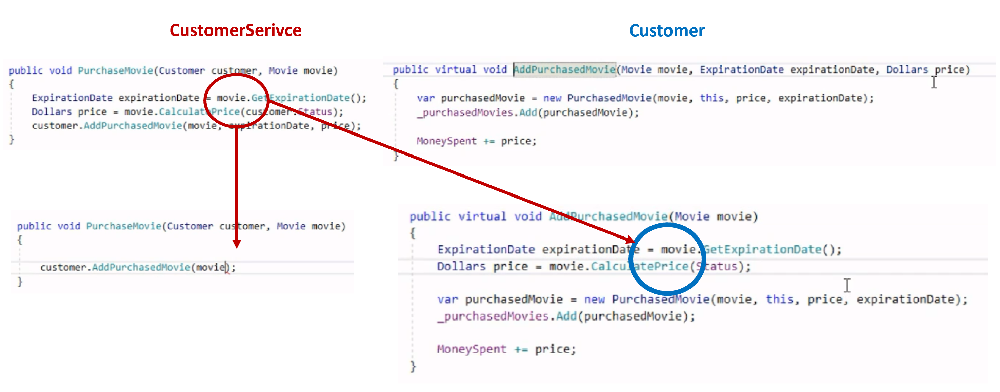  

- 구현 방법
  - `Movie` 클래스의 `GetExpirationDate`와 `CalculatePrice`을  
    -> `Customer` 클래스의 `AddPurchasedMovice`로 통합한다. 

### 로직 이동 
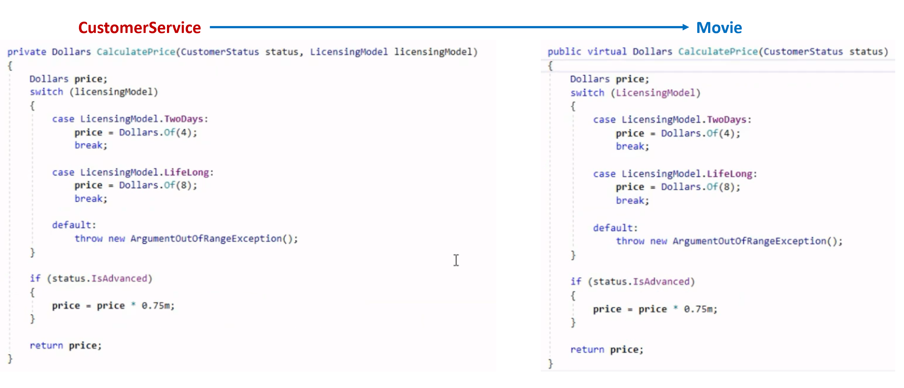    

- Movie 데이터만으로 `CalculatePrice`을 구현하고 있다.
- 구현 방법
  - 로직은 더 가까운 도메인 모델로 이동 시킨다. 

## MovieSerivce 리팩토링
### 로직 이동 
  

- Movie 데이터만으로 `GetExpirationDate`을 구현하고 있다.
- 구현 방법
  - 로직은 더 가까운 도메인 모델로 이동 시킨다. 

## CustomerStatus 리팩토링
### 도메인 표현 
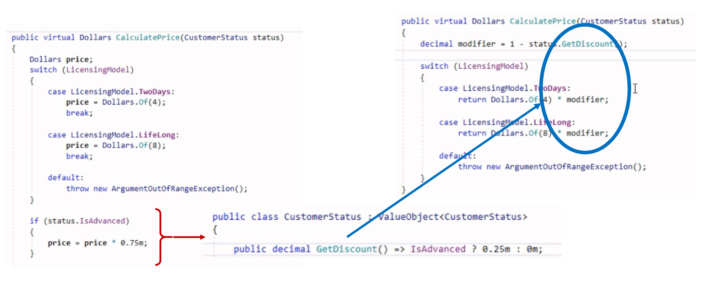  

- 가결 확인 비율을 `GetDiscount` 명시적으로 표현한다.

