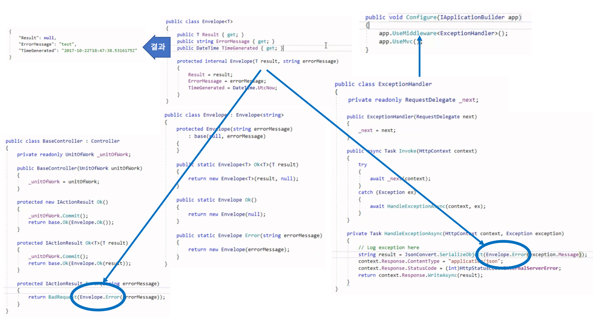
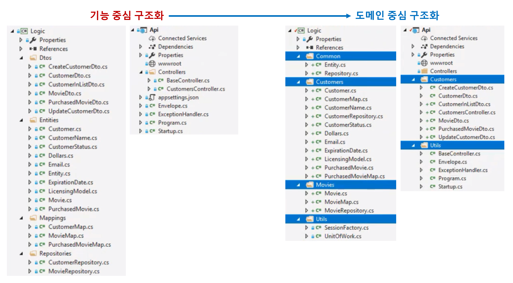

# 6장. Organizing the Application Services Layer

## Application Service 정의

## Repositories and Unit of Work

- `Commit` 책임은 `Unit of Work`이다.

## Global Unhanded Exceptions

- 출력 타입 표준화 : `Envelope`
- 예외 처리 Middleware : `ExceptionHandler`
- Unit of Work 통합 : `BaseController`

## 솔루션 탐색기 Layout
  

