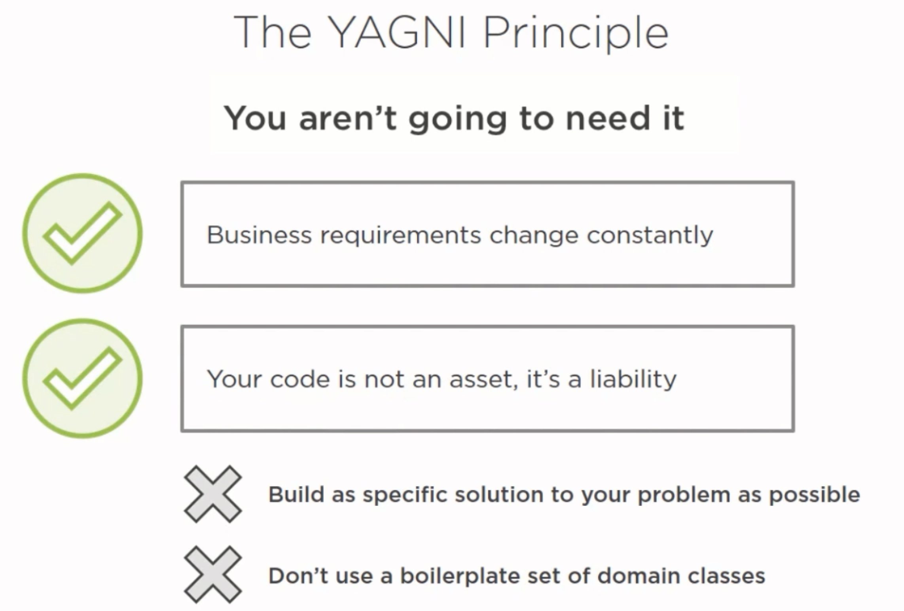
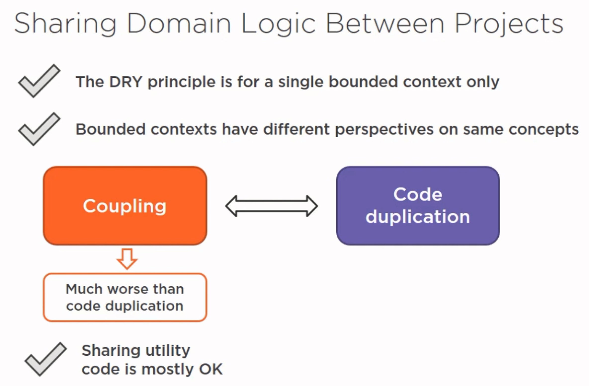
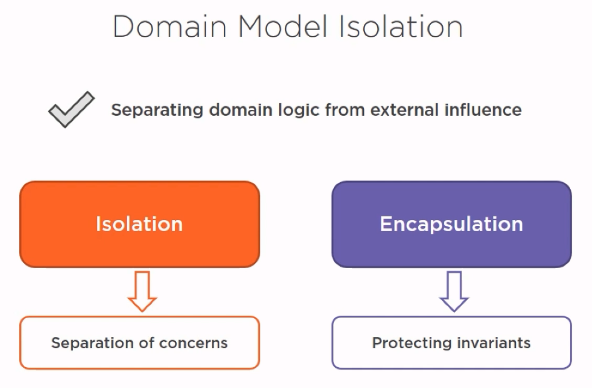
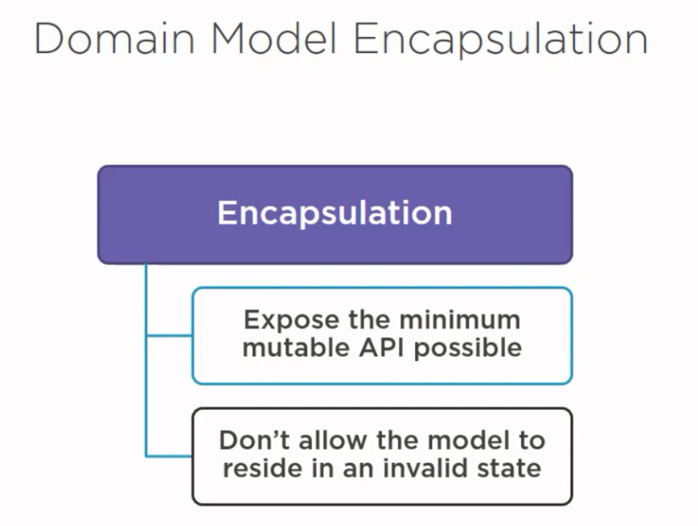
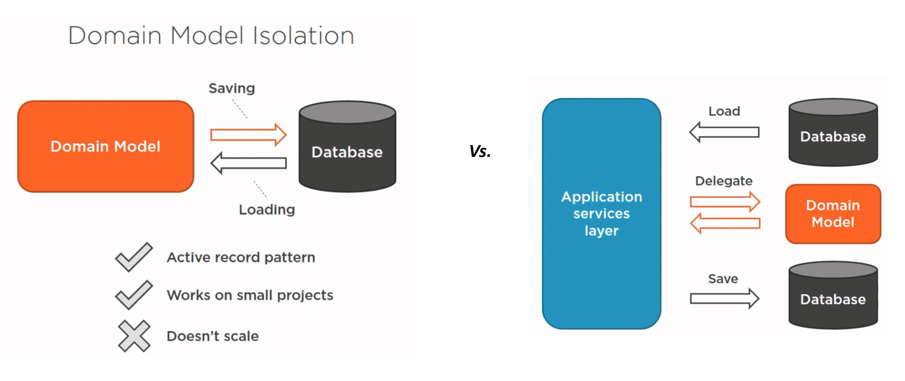
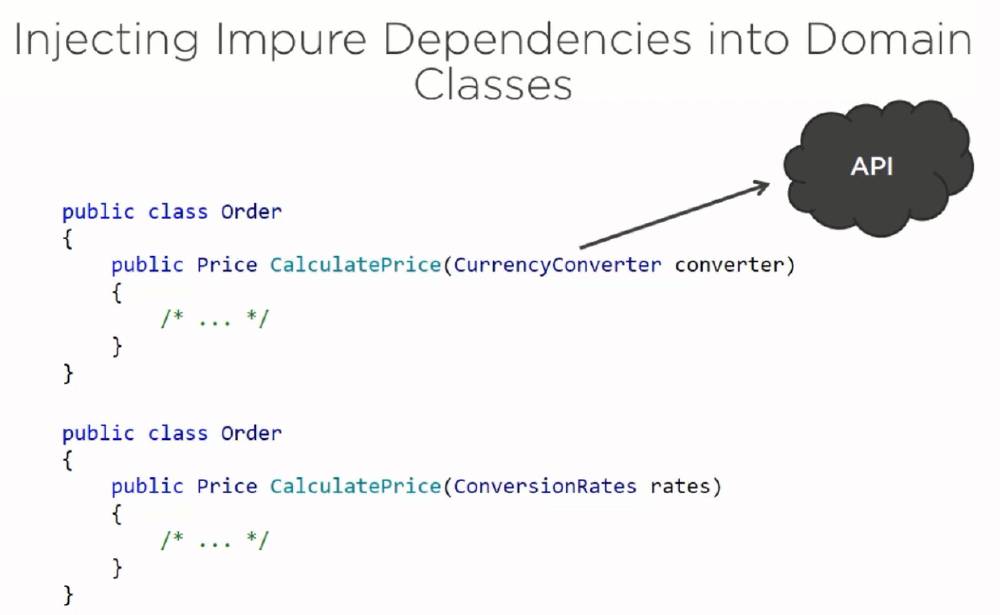
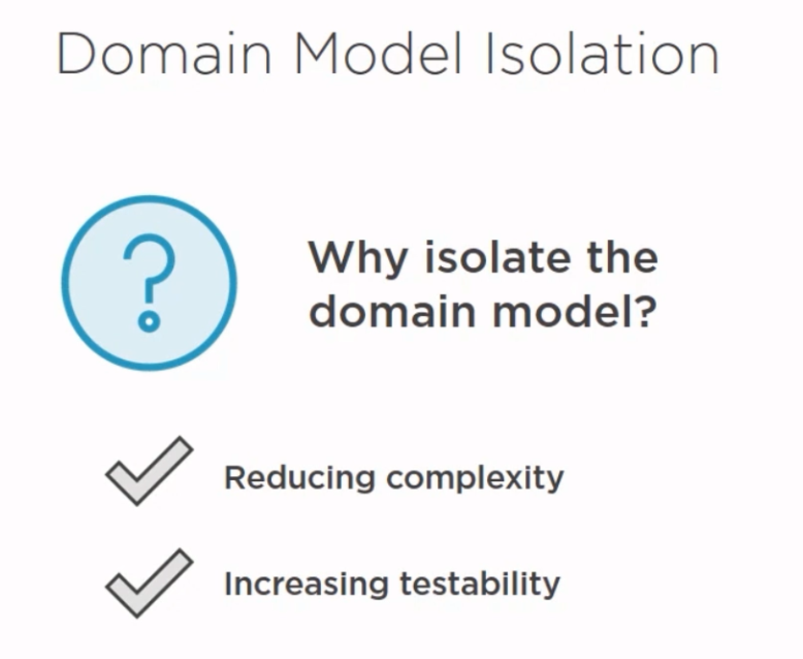

# 7장. Domain Modeling Best Practices

## YAGNI

## Coupling vs Code Duplication

## Domain Model Isolation vs. Domain Model Encapsulation 

## Domain Model Encapsulation 

## Domain Model Isolation

