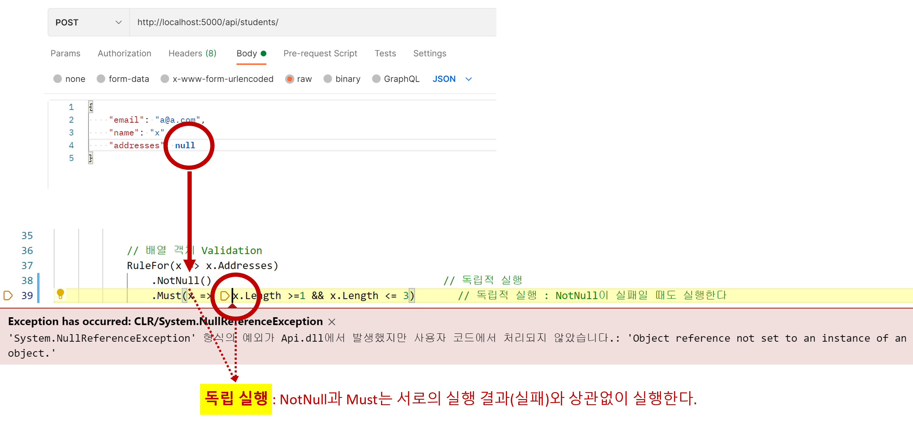

# Module 2. |> Step 3. Collection Properties Validation 이해하기

## 목차
- 목표
- 배열 Validation
- 배열 값 Validation
- 배열과 배열 값 Validation 통합
- Validation 이해
- Validation 중복 코드 제거

## 목표
- 배열과 배열 값 Validation
  - Inline nested rules(ChildRules) : 비 추천
  - Separate Validator(SetValidator)
    - 배열 : `public class AddressesVilidator : AbstractValidator<AddressDto[]>`
    - 배열 값 : `public class AddressVilidator : AbstractValidator<AddressDto>`
- ~~Inheritance(SetInheritanceValidator : Data Contract에서 존재 불가능한 개념)~~ → Only DomainModel에서 사용 
  - Data Contract에서는 상속 개념이 존재하지 않는다.
  - 상속 개념의 Validation은 DomainModel에서만 존재할 수 있다.
    - Setting up rules polymorphically
    - Only applicable to domain classes
- ~~Rule seet(RuleSet : CRUD-based)~~ → Task-based
  - validator와 Data Contract 재사용은 CRUD-based이다. Task-based 방향으로 설계해야 한다.
    - Reusing validators : Validation 재사용 비 추천
    - Don't reuese data contracts : Data Contract은 재사용 하지 않는다.
- ~~Throw exception~~
  - Validations ≠ Exceptional situation
  - Don't use exceptions for validation
  - 예외는 복구할 수 없는 하드웨어 오류와 같은 예외적인 상황에서만 사용한다.

## 배열 Validation
```cs
RuleFor(x => x.Addresses)
  .NotNull()
  .Must(x => x.Length >=1 && x.Length <= 3)
  .WithMessage("The number of addresses must be between 1 and 3");
```
- 독립 실행 : `NotNull`과 `Must`은 서로의 실행 결과에 의존하지 않고 실행한다.
  

## 배열 값 Validation
```cs
RuleForEach(x => x.Addresses)
  .SetValidator(new AddressVilidator());

public class AddressVilidator : AbstractValidator<AddressDto>
{
  // ...
}
```

## 배열과 배열 값 Validation 통합
```cs
RuleFor(x => x.Addresses)
  .NotNull()                                      // 독립적 실행
  .Must(x => x?.Length >=1 && x.Length <= 3)      // 독립적 실행 : NULL 처리
  .WithMessage("The number of addresses must be between 1 and 3")
  .ForEach(x => x.SetValidator(new AddressVilidator()));
```

## Validation 이해
- Validation 코드
  ```cs
  RuleFor(x => x.Addresses)
    .NotNull()                                      // 독립적 실행
    .Must(x => x?.Length >=1 && x.Length <= 3)      // 독립적 실행 : NULL 처리
    .WithMessage("The number of addresses must be between 1 and 3")
    .ForEach(x => 
    {
        x.NotNull();
        x.SetValidator(new AddressVilidator());
    });
  ```
- 배열 NULL : `.NotNull()`
  ```json
  {
    "email": "a@a.com",
    "name": "x",
    "addresses": null
  }
  ```
- 배열 길이 : `.Must(x => x?.Length >=1 && x.Length <= 3)`
  ```json
  {
    "email": "a@a.com",
    "name": "x",
    "addresses": [ ]
  }
  ```
- 배열 값 NULL : `x.NotNull()`
  ```json
  {
    "email": "a@a.com",
    "name": "x",
    "addresses": [
        {
            "street": "xxx",
            "city": "Carlington",
            "state": "VA",
            "zipCode": "22203"
        },
        null
    ]
  }
  ```
- 배열 값 : `x.SetValidator(new AddressVilidator())`
  ```cs
  public class AddressVilidator : AbstractValidator<AddressDto>
  {
      public AddressVilidator()
      {
          RuleFor(x => x.Street).NotEmpty().Length(0, 100);
          RuleFor(x => x.City).NotEmpty().Length(0, 40);
          RuleFor(x => x.State).NotEmpty().Length(0, 2);
          RuleFor(x => x.ZipCode).NotEmpty().Length(0, 5);
      }
  }
  ```

## Validation 중복 코드 제거
- `RegisterRequestValidator`과 `EditPersonalInfoRequestValidator`에서 `Addresses` Validation 코드 중복이 발생하고 있다.
  ```cs
  public class RegisterRequestValidator : AbstractValidator<RegisterRequest>
  {
      public RegisterRequestValidator()
      {
          // ...

          RuleFor(x => x.Addresses)
              .NotNull()                                      // 독립적 실행
              .Must(x => x?.Length >=1 && x.Length <= 3)      // 독립적 실행 : NULL 처리
              .WithMessage("The number of addresses must be between 1 and 3")
              .ForEach(x => 
              {
                  x.NotNull();
                  x.SetValidator(new AddressVilidator());
              });
      }
  }  

  public class EditPersonalInfoRequestValidator : AbstractValidator<EditPersonalInfoRequest>
  {
      public EditPersonalInfoRequestValidator()
      {
          // ...

          RuleFor(x => x.Addresses)
              .NotNull()                                      // 독립적 실행
              .Must(x => x?.Length >=1 && x.Length <= 3)      // 독립적 실행 : NULL 처리
              .WithMessage("The number of addresses must be between 1 and 3")
              .ForEach(x => 
              {
                  x.NotNull();
                  x.SetValidator(new AddressVilidator());
              });
      }
  }
  ```
- 증북 코드 제거(통합)
  ```cs
  public class AddressesVilidator : AbstractValidator<AddressDto[]>
  {
      public AddressesVilidator()
      {
          RuleFor(x => x)
              //.NotNull()                                      // 독립적 실행
              .Must(x => x?.Length >=1 && x.Length <= 3)      // 독립적 실행 : NULL 처리
              .WithMessage("The number of addresses must be between 1 and 3")
              .ForEach(x => 
              {
                  x.NotNull();
                  x.SetValidator(new AddressVilidator());
              });
      }
  }

  public class RegisterRequestValidator : AbstractValidator<RegisterRequest>
  {
      public RegisterRequestValidator()
      {
          // ...

          RuleFor(x => x.Addresses)
              .NotNull()   
              .SetValidator(new AddressesVilidator());
      }
  }  

  public class EditPersonalInfoRequestValidator : AbstractValidator<EditPersonalInfoRequest>
  {
      public EditPersonalInfoRequestValidator()
      {
          // ...

          RuleFor(x => x.Addresses)
              .NotNull()   
              .SetValidator(new AddressesVilidator());
      }
  }
  ```

## TODO 개선 항목
- 독립 실행 부작용 개선하기
- 실패 예러 메시지
  - 메시지 : `'Addresses'은(는) 반드시 입력해야 합니다.`
