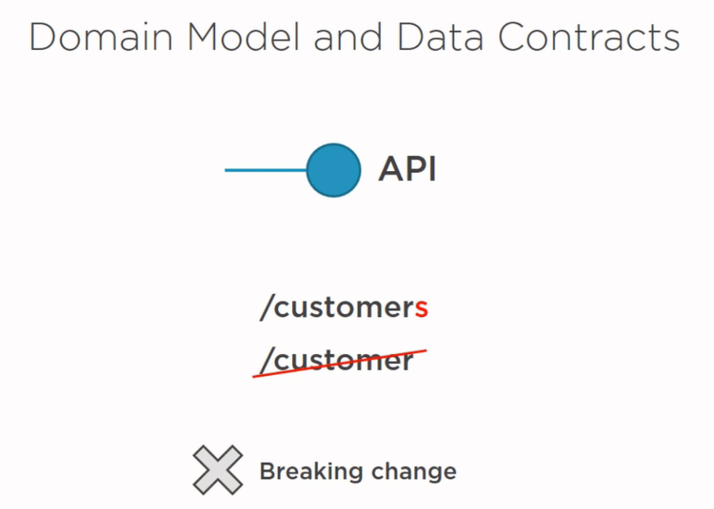
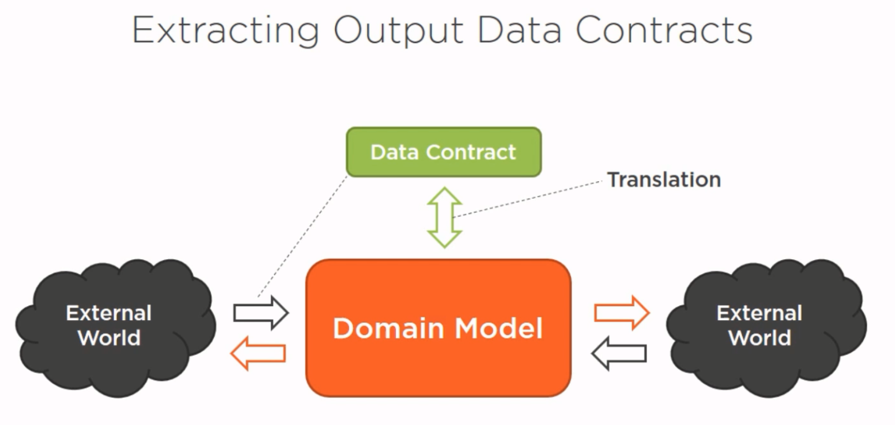
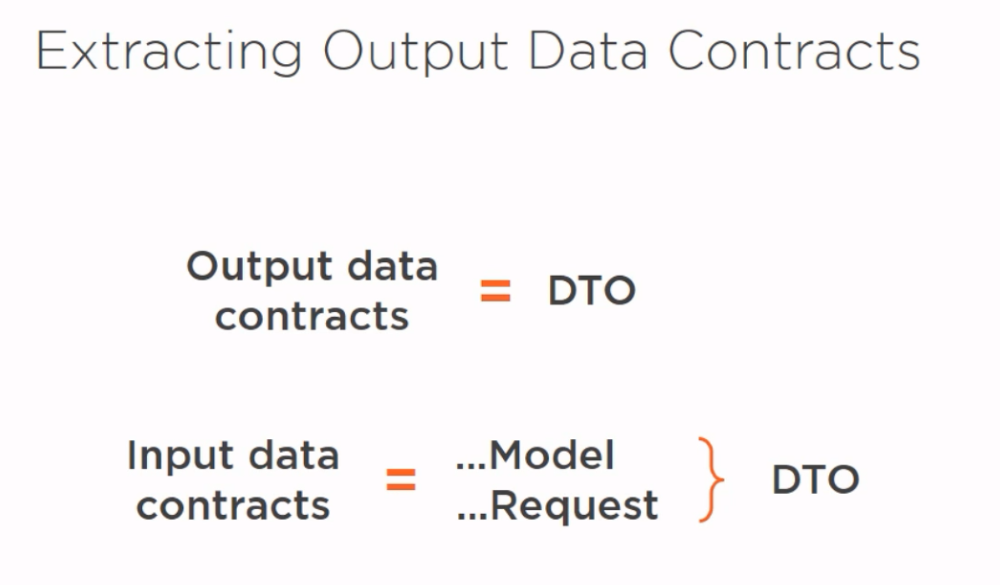

# 3장. Decoupling the Domain Model from Data Contracts

## Data contracts 필요성
- API URL 하위 호환성
  
- API 데이터 타입 하위 호환성
  
- Domain Model이 Data contracts 역할을 수행할 때 문제점
  - Coupling domain model to data contracts = Serialization of domain entities  
  - Domain model이 Data contracts 역할(API 입/출력 데이터 타입) 을 수행하게 된다.
	- Domain model에 입력 제약 조건을 정의한다(유효성).
	- Domain model에 저장 제약 조건을 정의한다(영속성).

## Data contracts


- Data contracts와 Domain Model 관계
  ```
	Data contracts 	-Transfer-> 		| Domain Model
		불변		   수정    		| 	
							|
			 DTO(Data Transfer Objects) --->|
  ```
- Data contracts 정의
  - Shape of incoming and outcoming data
  - API 입/출력 데이터 타입

## DTO 이름


## Anemic Domain Model 리팩토링
- 목표
  - Domain model의 API 입/출력 데이터 타입 역할에서 제외 시킨다.
- Domain model 클래스 리팩토링
  - 입력 제약 조건 속성 제거(유효성 : 애플리케이션)
  - 저장 제약 조건 속성 제거(영속성 : 애플리케이션)
- DTO 클래스 만들기
  - Entity 클래스를 Dto 클래스로 복사
  - Entity 부모 클래스 제거
  - Id 추가
  - virtual 제거
  - 반복(모든 객체)

## Doamin Model
- 특징
  - 모든 데이터가 일관되고(무결성) 불변이 위반되지 않는다고(불변성) 확신하는 공간 
  - 통제할 수 있는 곳